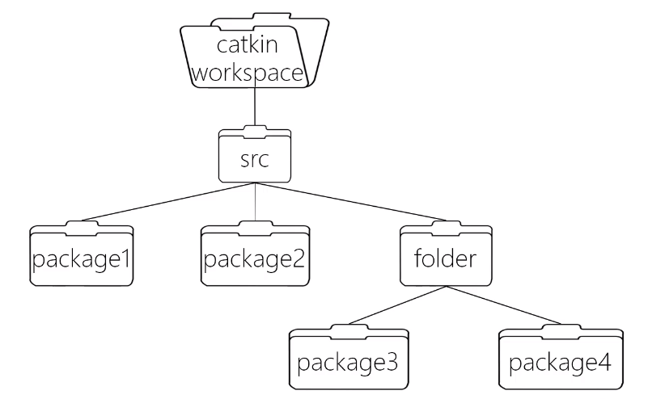
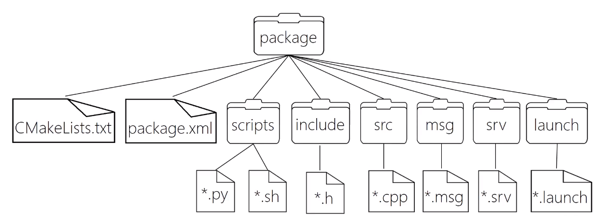

# Catkin基础

### 介绍

ROS定制的编译构建系统，对CMake的扩展

---

**catkin工作空间**

组织和管理功能包的文件夹，以catkin工具编译

---

*1、建立工作空间*

```
mkdir -p ~/catkin_ws/src
cd ~/catkin_ws/
catkin_make
source ~/catkin_ws/devel/setup.bash //编译完成后要source刷新环境
```
```catkin_make```之后可以得到```build```以及```devel```


---

```catkin_make```最小单元为```package```-功能包，```src```组织结构为：


---

*2、package组成*

ROS软件的基本组织形式，catkin编译的基本单元，一个package可以包含多个可执行文件（节点）


---

*3、包管理指令*

1）rospack 

查找某个pkg的地址
```
rospack find <pkg_name>
```
列出本地所有pkg
```
rospack list
```
2）roscd
跳转到某个pkg路径下
```
roscd <pkg_name>
```
3）rosls
列举某个pkg下的文件信息
```
rosls <pkg_name>
```
4）rosed
编辑pkg中的文件
```
rosed <pkg_name> <file_name>
```
5）catkin_create_pkg
创建一个pkg
```
catkin_create_pkg <pkg_name> [deps]
```
6）rosdep
安装某个pkg所需的依赖
```
rosdep install <pkg_name>
```