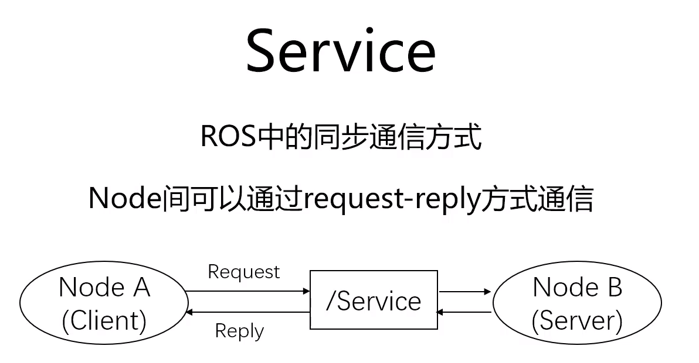
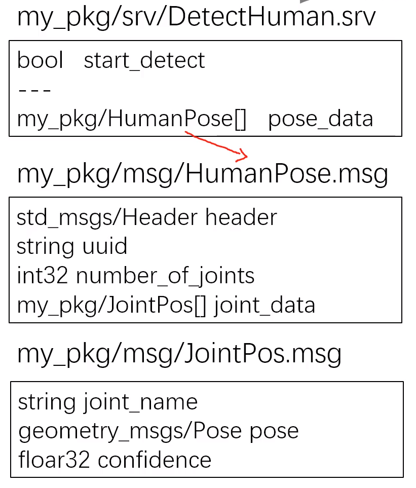
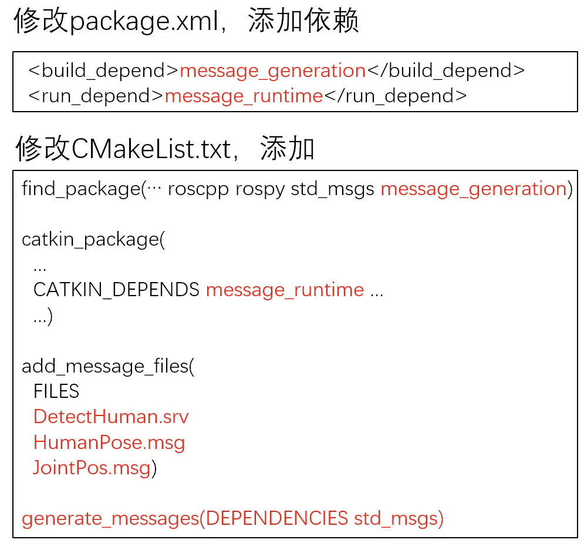

# ROS通信方式之Service

同步：client发送完请求之后，会阻塞等待返回信息

/Service为string,client->Server(多对一)


---

### Srv

service内容的数据类型，定义在*.srv文件中

示例：srv可以嵌套msg,---分开请求与应答的格式



---

自定义srv或者msg后，需要对package.xml以及CMList.txt进行修改



### 常用命令

1）rosservice

列出当前所有活跃的service
```
rosservice list
```
显示某个service的属性信息
```
rosservice info <service_name>
```
调用某个service
```
rosservice call <service_name> args
```

2）rossrv

列出系统上所有srv
```
rossrv list
```
显示某个srv的内容
```
rossrv show /<srv_name>
```
