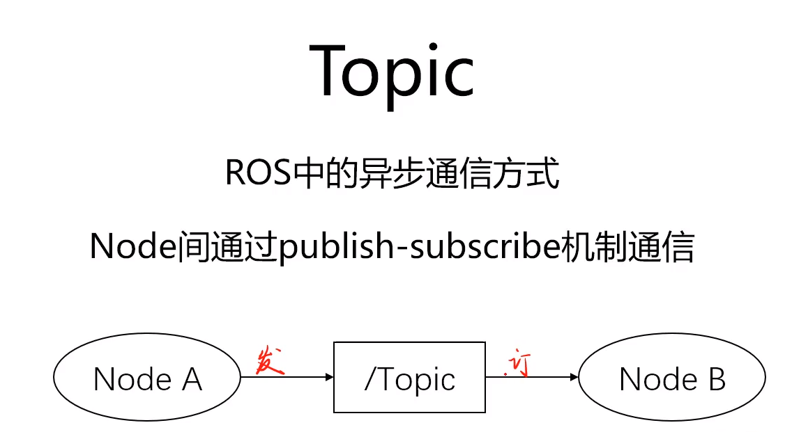
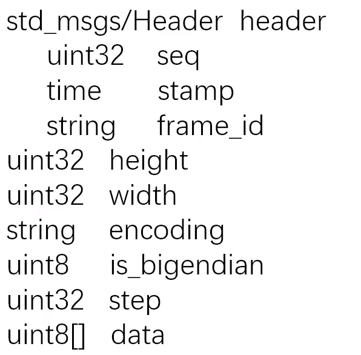

# ROS通信方式之Topic

异步：对于发布者而言，不需要等待消息返回状态,一个node可以被多个node订阅

/Topic为string，Publisher->Subscriber(多对多)


---

### Message

topic内容的数据类型，定义在*.msg文件中

基本msg包括bool,int8,int16,int32,int64(以及uint)

flaot32,float64,string

time,duration,header

可变长度数组array[],固定长度数组array[c]

示例：类似为一个struct



---

### 常用命令

1）rostopic

列出当前所有topic
```
rostopic list
```
显示某个topic的属性信息
```
rostopic info /<topic_name>
```
显示某个topic的内容
```
rostopic echo /<topic_name>
```
向某个topic发布内容
```
rostopic pub /<topic_name>
```

2）rosmsg

列出系统上所有msg
```
rosmsg list
```
显示某个msg的内容
```
rosmsg show /<msg_name>
```
