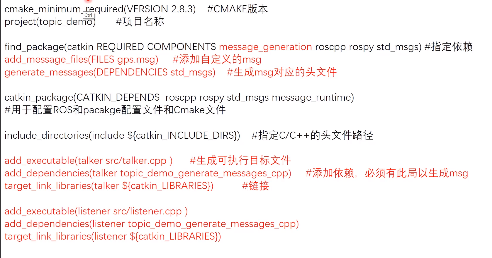
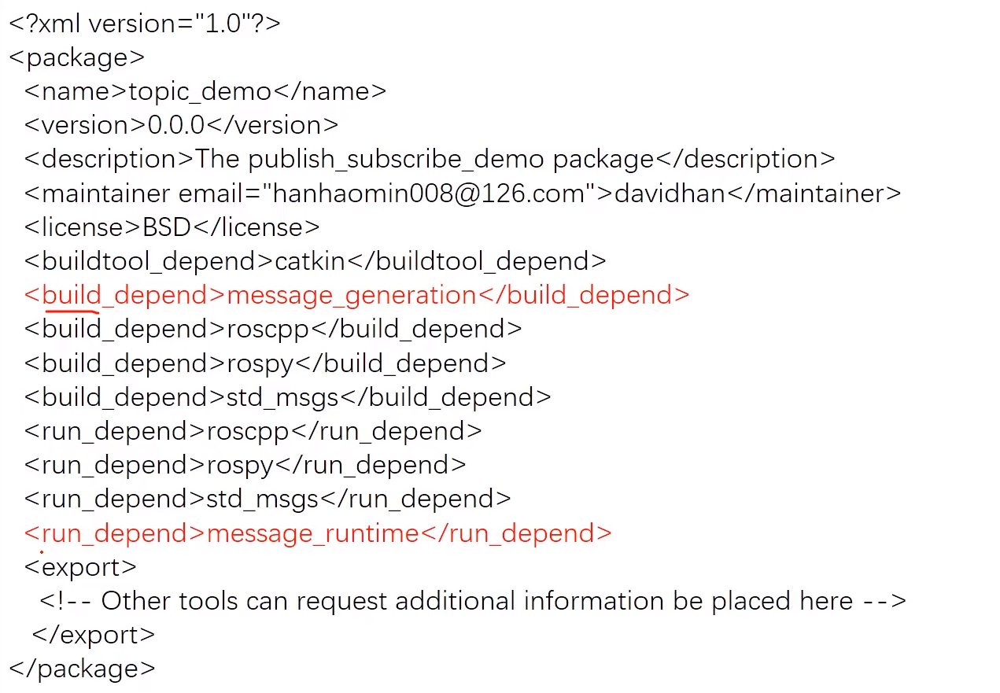

# service_demo

---

### 功能描述

两个node,一个发布请求（格式为自定义），另一个接收处理该信息，并返回信息

---

### 步骤

1）package
```
cd ~/catkin_ws/src
catkin_create_pkg service_demo roscpp rospy std_msgs
```
2）srv
```
cd ~/catkin_ws/src/service_demo
mkdir srv
cd srv
touch Greeting.srv
```
Greeting.srv
```
string name
int32 age
---
string feedback
``` 
Greeting.srv编译之后会生成

~/catkin_ws/devel/include/service_demo/Greeting.h

~/catkin_ws/devel/include/service_demo/GreetingRequest.h

~/catkin_ws/devel/include/service_demo/GreetingResponse.h

3）server.cpp
```
#include <ros/ros.h>
#include <service_demo/Greeting.h>

bool handle_function(service_demo::Greeting::Request &req,service_demo::Greeting::Response &res){
    ROS_INFO("Request from %s with age %d",req.name.c_str(),req.age);
    res.feedback="Hi "+req.name+",I'm server!";
    return true;
}

int main(int argc,char** argv){
    ros::init(argc,argv,"greetings_server"); //解析参数，为本node命名
    ros::NodeHandle nh; //创建句柄，实例化node
    ros::ServiceServer service=nh.advertiseService("greetings",handle_function); //创建service,handle_function为回调函数
    ros::spin(); //循环等待回调函数,阻塞，ros::spinOnce()非阻塞,只执行一次
    return 0;
}
```
4）client.cpp
```
#include <ros/ros.h>
#include <service_demo/Greeting.h>

int main(int argc,char** argv){
    ros::init(argc,argv,"greetings_client"); //解析参数，为本node命名
    ros::NodeHandle nh; //创建句柄，实例化node
    ros::ServiceClient client=nh.serviceClient<service_demo::Greeting>("greetings"); //创建client
    service_demo::Greeting srv; //实例化请求
    srv.request.name="Tom";
    srv.request.age=20;

    if(client.call(srv)){ //调用service
        ROS_INFO("Response from server: %s",srv.response.feedback.c_str());
    }else{
        ROS_ERROR("Failed to call service greetings");
        return 1;
    }
    return 0;
}
```

5）CMakeLists.txt&package.xml

CMakeLists.txt,参考如下


package.xml，参考如下
