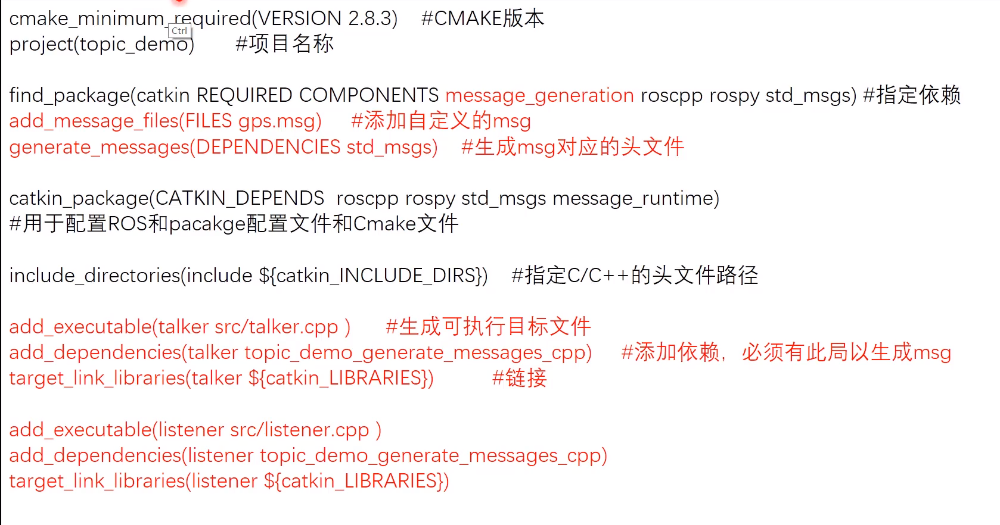
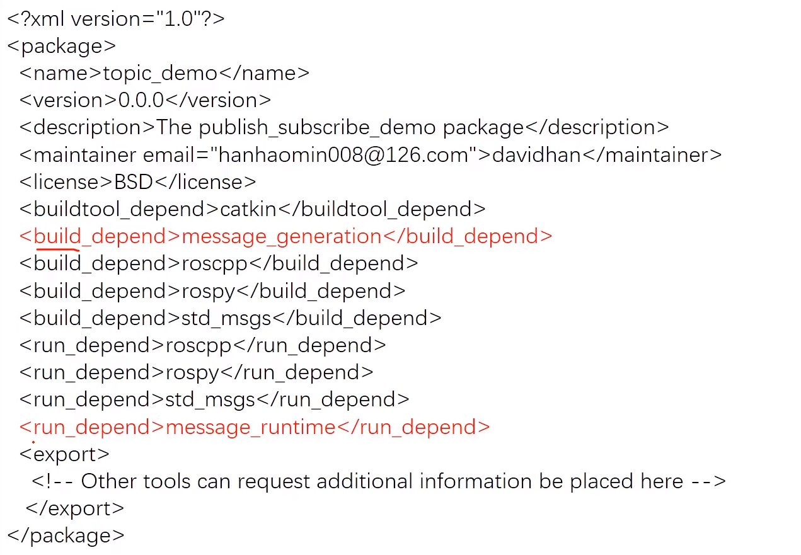

# topic_demo

---

### 功能描述

两个node,一个发布模拟的GPS消息（格式为自定义，包括坐标和工作状态），另一个接收并处理该信息（计算到原点的距离）

---

### 步骤

1）package
```
cd ~/catkin_ws/src
catkin_create_pkg topic_demo std_msgs rospy roscpp
```
2）msg
```
cd ~/catkin_ws/src/topic_demo
mkdir msg
cd msg
touch gps.msg
```
gps.msg
```
float32 x
float32 y
string state
``` 
gps.msg编译之后会生成gps.h文件（~/catkin_ws/devel/include/topic_demo/gps.h），用于C++程序中的引用

3）talker.cpp
```
#include <ros/ros.h>
#include <topic_demo/gps.h>
int main(int argc,char** argv){
    ros::init(argc,argv,"talker"); //解析参数，为本node命名
    ros::NodeHandle nh; //创建句柄，实例化node
    topic_demo::gps msg; //实例化gps消息
    msg.x=1.0;
    msg.y=1.0;
    msg.state="working";
    ros::Publisher pub=nh.advertise<topic_demo::gps>("gps_info",1); //创建publisher,1为队列长度，随时发送设置为1
    ros::Rate loop_rate(1.0); //设置发布频率，1Hz
    while(ros::ok()){     //ros::ok(),是否关闭
        msg.x=1.03*msg.x;
        msg.y=1.0*msg.y;
        ROS_INFO("Talker:GPS:x=%f,y=%f",msg.x,msg.y); //打印消息
        pub.publish(msg); //发布消息
        loop_rate.sleep(); //根据定义的发布频率，sleep
    }
    return 0;
}
```
4）listener.cpp
```
#include <ros/ros.h>
#include <topic_demo/gps.h>
#include <std_msgs/Float32.h>

void gpscallBack(const topic_demo::gps::ConstPtr& msg){
    std_msgs::Float32 dis;
    dis.data=sqrt(pow(msg->x,2)+pow(msg->y,2));
    ROS_INFO("Listener:distant to origin=%f",state=%s,dis.data,msg->state.c_str());
}

int main(int argc,char** argv){
    ros::init(argc,argv,"listener"); //解析参数，为本node命名
    ros::NodeHandle nh; //创建句柄，实例化node
    ros::Subscriber sub=nh.subscribe("gps_info",1,gpscallBack); //创建subscriber,随时接收设置为1，gpscallBack为回调函数,处理接收到的消息
    ros::spin(); //循环等待回调函数,阻塞，ros::spinOnce()非阻塞,只执行一次
    return 0;
}
```

5）CMakeLists.txt&package.xml

CMakeLists.txt


package.xml
