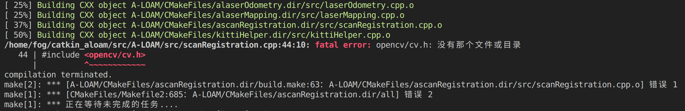
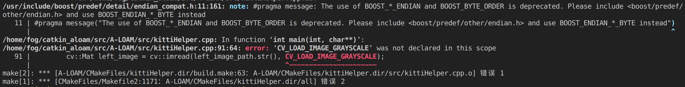

# Ubuntu20.04中配置ALOAM

### 要求

默认安装PCL版本1.10，不适用，改为1.8，

ceres版本1.13

opencv版本4.2.0

---

*1、PCL安装*

详情见SLAM/env.md

*2、Ceres安装*

详情见SLAM/env.md

*3、opencv安装*

```
sudo apt-get install libopencv-dev
```

---

### 构建ROS工作空间
```
mkdir -p aloam_ws/src
cd aloam_ws/src
git clone https://github.com/HKUST-Aerial-Robotics/A-LOAM.git
cd ..
catkin_make
```

### 编译错误

*1、fatal error: opencv/cv.h: No such file or directory*

在opencv4中opencv2的cv.h融合进了imgproc.hpp里，所以把源码中的#include <opencv/cv.h>改成#include <opencv2/opencv.hpp>即可

*2、error: 'CV_LOAD_IMAGE_GRAYSCALE' was not declared in this scope*

cv::IMREAD_GRAYSCALE代替CV_LOAD_IMAGE_GRAYSCALE, 4.x版本中已经没有CV_LOAD_IMAGE_GRAYSCALE了