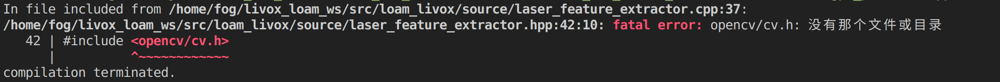
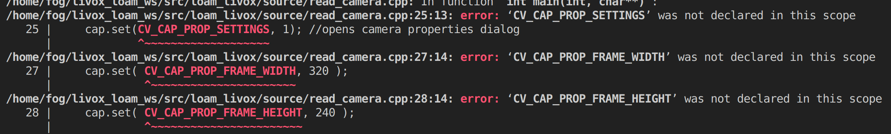

# Ubuntu20.04中配置LOAM-LIVOX

### 要求

默认安装PCL版本1.10

ceres版本2.1.0

opencv版本4.2.0

---

*1、PCL安装*

详情见SLAM/env.md

*2、Ceres安装*

详情见SLAM/env.md

*3、opencv安装*

```
sudo apt-get install libopencv-dev
```

*4、LIVOX-SDK安装*

```
git clone https://github.com/Livox-SDK/Livox-SDK.git
cd Livox-SDK/build
cmake ..
make -j8
sudo make install
```

---

### 构建ROS工作空间
```
mkdir -p loam_livox_ws/src
cd loam_livox_ws/src
git clone https://github.com/hku-mars/loam_livox.git
git clone https://github.com/Livox-SDK/livox_ros_driver.git
cd ..
catkin_make
```

### 注意事项

*1、ceres版本2.1.0中，livox_ros_driver编译需要将C++14修改为C++17,
需要g++ 7.0以上的版本*

### 编译错误

*1、fatal error: opencv/cv.h: No such file or directory*

在opencv4中opencv2的cv.h融合进了imgproc.hpp里，所以把源码中的#include <opencv/cv.h>改成#include <opencv2/opencv.hpp>即可

*2、error:'CV_CAP_PROP_SETTINGS'/'CV_CAP_PROP_FRAME_WIDTH'/ 
'CV_CAP_PROP_FRAME_HEIGHT' was not declared in this scope*



CV_CAP_PROP_SETTINGS改为cv::CAP_PROP_SETTINGS
CV_CAP_PROP_FRAME_WIDTH改为cv::CAP_PROP_FRAME_WIDTH
CV_CAP_PROP_FRAME_HEIGHT改为cv::CAP_PROP_FRAME_HEIGHT