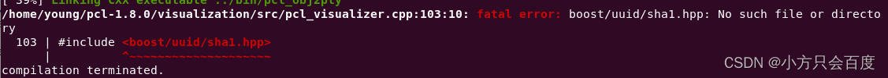
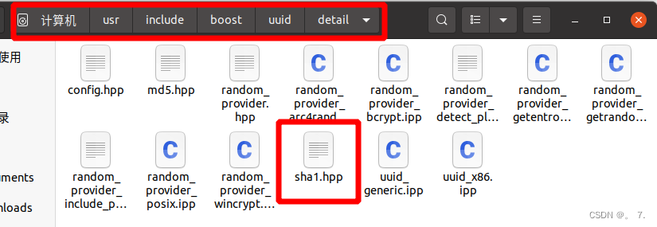
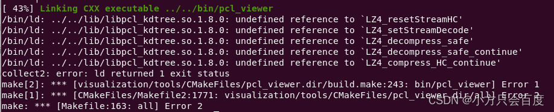
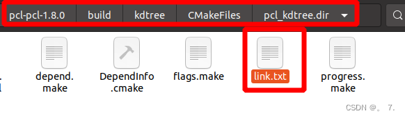
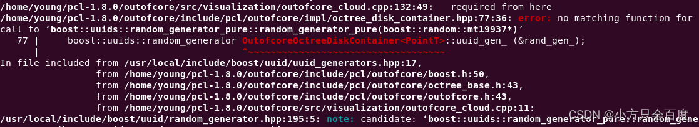
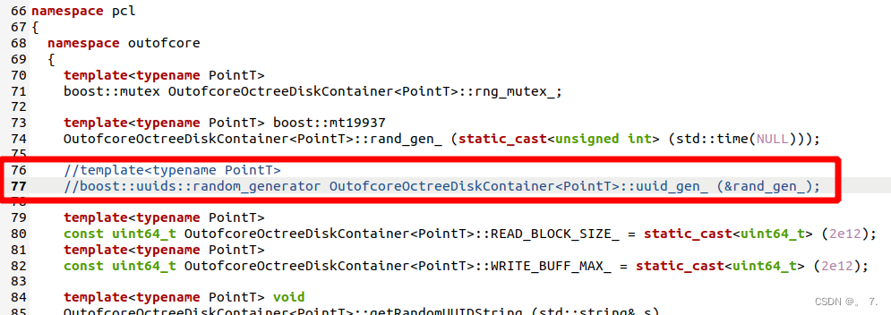
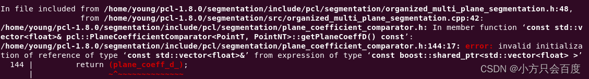
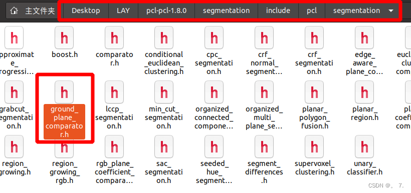
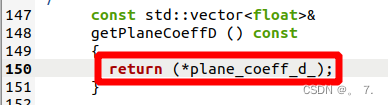

# SLAM相关库环境配置

### 1、pcl
```
系统默认版本
sudo apt-get install libpcl-dev

自定义其他版本（示例安装pcl-1.8,安装于/usr/local/pcl-1.8）
github上下载对应版本源码，解压（https://github.com/PointCloudLibrary/pcl/release）
cd pcl-1.8
mkdir build && cd build
cmake -DCMAKE_BUILD_TYPE=Release -DCMAKE_INSTALL_PREFIX=/usr/local/pcl-1.8 ..
make -j8
sudo make install

使用，cmake时添加
set(PCL_DIR "/usr/local/pcl-1.8/share/pcl-1.8")
find_package(PCL 1.8 REQUIRED)

可选
include_directories(${PCL_INCLUDE_DIRS})
link_directories(${PCL_LIBRARY_DIRS})
add_definitions(${PCL_DEFINITIONS})
```

#### Ubuntu20.04安装pcl-1.8,源码编译遇到问题：(https://blog.csdn.net/dui845819593/article/details/128486864)(https://blog.csdn.net/fffyyyhhh12/article/details/126889810)

#### 问题1 fatal error: boost /uuid/sha1.hpp: No such file or directory


原因：sha1.hpp在电脑中的路径不一致

解决：将pcl_visualizer.cpp文件中 103行的 <boost/uuid/sha1.hpp> 更改为<boost/uuid/detail/sha1.hpp>


#### 问题2


解决：/pcl/build/kdtree/CMakeFiles/pcl_kdtree.dir/下的link.txt里在末尾写上：-llz4


#### 问题3 outofcore相关


pcl-pcl-1.8.0/outofcore/include/pcl/outofcore/impl/octree_disk_container.hpp 文件下的76和77行代码，将他们注释掉


#### 问题4


解决：在plane_coefficient_comparator.h中的return (plane_coeff_d_)修改为
return (* plane_coeff_d_)



---
### 2、Eigen
```
sudo apt-get install libeigen3-dev
```
---
### 3、ceres
官方教程(http://ceres-solver.org/installation.html)
```
安装依赖
# google-glog + gflags
sudo apt-get install libgoogle-glog-dev libgflags-dev
# Use ATLAS for BLAS & LAPACK
sudo apt-get install libatlas-base-dev
# Eigen3
sudo apt-get install libeigen3-dev
# SuiteSparse (optional)
sudo apt-get install libsuitesparse-dev

编译安装
tar zxf ceres-solver-1.13.tar.gz
mkdir build && cd build
cmake -DCMAKE_BUILD_TYPE=Release -DCMAKE_INSTALL_PREFIX=/usr/local/ceres-1.13 ..
make -j8
sudo make install

(-DCMAKE_INSTALL_PREFIX=/usr/local/ceres-1.13自定义路径，可实现多版本)
当需要使用时，set(CERES_DIR /usr/local/ceres-1.13/share/Ceres)
```
---