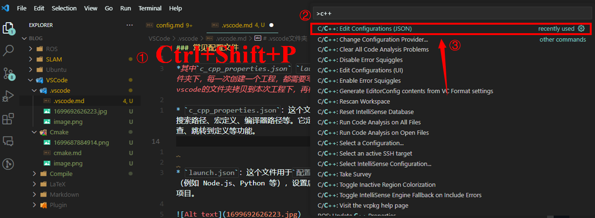
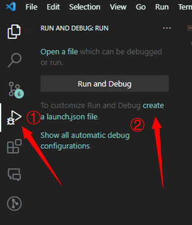
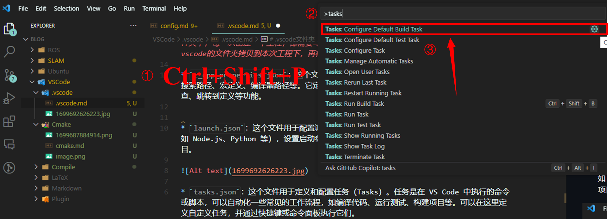

# .vscode文件夹

### 介绍

在VSCode中，当新建一个项目后，会在项目根目录下生成一个名为`.vscode`的文件夹。这个文件夹是用来存放与项目配置和工具相关的文件的。它提供了一些功能和设置，可以帮助我们更好地管理和开发项目。官方文档：https://code.visualstudio.com/docs/cpp/config-linux

---

### 常见配置文件

*其中`c_cpp_properties.json` `launch.json` `tasks.json`三个文件位于.vscode的文件夹下，每一次创建一个工程，都需要写一次，很麻烦，官方给出的解决方案是将上一次的.vscode的文件夹拷贝到本次工程下，再根据具体的需求，修改文件。*

* `c_cpp_properties.json`：这个文件用于配置 IntelliSense。可以在这里设置头文件的搜索路径、宏定义、编译器路径等。它定义了如何分析和理解代码，以便提供代码补全、语法检查、跳转到定义等功能。


**ON Linux**
```
{
  "configurations": [
    {
      "name": "Linux",
      "includePath": ["${workspaceFolder}/**"], // 头文件的搜索路径
      "defines": [],
      "compilerPath": "/usr/bin/gcc", // gcc的路径
      "cStandard": "c11", // c语言标准
      "cppStandard": "c++17", // c++语言标准
      "intelliSenseMode": "clang-x64"
    }
  ],
  "version": 4
}
```

---

* `launch.json`：这个文件用于`配置调试器`。可以在这里设置调试选项，如指定调试目标（例如 Node.js、Python 等），设置启动参数、环境变量等。它定义了如何启动和调试VSCode项目。


**ON Linux**
```
{
  "version": "0.2.0",
  "configurations": [
    {
      "name": "C/C++: g++ build and debug active file",
      "type": "cppdbg",
      "request": "launch",
      "program": "${fileDirname}/${fileBasenameNoExtension}", //需要进行调试的可执行文件
      "args": [],
      "stopAtEntry": false, // 是否在程序入口处(main)停止
      "cwd": "${workspaceFolder}",
      "environment": [], // 环境变量
      "externalConsole": false, // 是否在外部控制台中运行程序
      "MIMode": "gdb",
      "miDebuggerPath": "/usr/bin/gdb", // gdb的路径
      "setupCommands": [
        {
          "description": "Enable pretty-printing for gdb",
          "text": "-enable-pretty-printing",
          "ignoreFailures": true
        }
      ],
      "preLaunchTask": "Build"  //在launch之前运行的任务名，这个名字一定要跟tasks.json中的任务名字大小写一致
    }
  ]
} 
```

---

* `tasks.json`：这个文件用于定义和配置任务(`配置编译器`)。任务是在 VS Code 中执行的命令或脚本，可以自动化一些常见的工作流程，如编译代码、运行测试、构建项目等。可以在这里定义自定义任务，并通过快捷键或命令面板执行它们。


**ON Linux**
```
{
    // See https://go.microsoft.com/fwlink/?LinkId=733558
    // for the documentation about the tasks.json format
    "version": "2.0.0",
    "options": {
        "cwd":"${workspaceFolder}/build" // 执行任务的工作目录
    },
    "tasks": [
        {
            "label": "cmake",
            "type": "shell",
            "command": "cmake",
            "args":[
                ".."
            ]
        },
        {
            "label":"make",
            "group":{
                "kind": "build",
                "isDefault": true
            },
            "command":"make",
            "args": [
 
            ]
        },
        {
            "label":"Build",
            "dependsOrder": "sequence", // 依赖顺序，sequence表示按顺序执行，parallel表示并行执行
            "dependsOn":[
                "cmake",
                "make"
            ]
        }
    ]
}
```

---

* `settings.json`：这个文件包含了项目的设置选项。可以在这里进行各种配置，如设置代码风格、启用或禁用扩展插件、定义编辑器的行为等。这些设置会覆盖全局设置，只对当前项目有效。

---

* `extensions.json`：这个文件用于记录项目所依赖的扩展插件。当共享项目时，其他人可以根据这个文件安装所需的插件，以便与大家的开发环境保持一致。