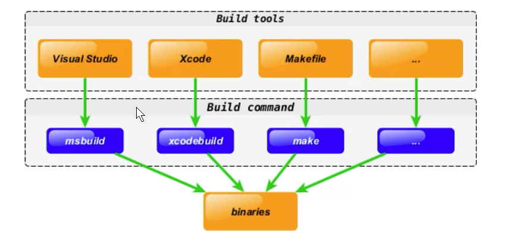
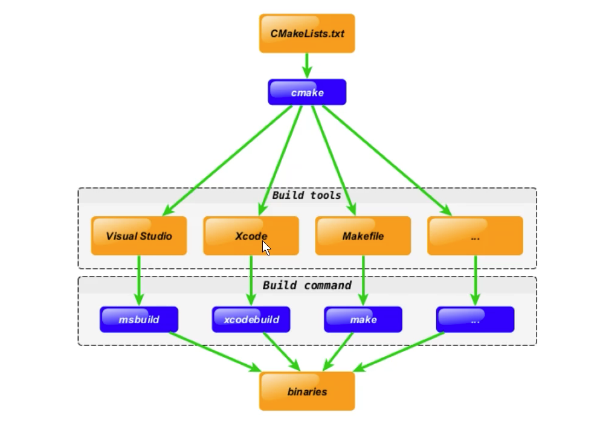

# CMake

### 前言

* CMake是一个跨平台的安装编译工具，可以用简单的语句来描述所有平台的安装(编译过程)。
  
* CMake可以说已经成为大部分C++开源项目标配

---

### Cross-platform development

没有cmake时，需要针对不同平台编写不同的构建脚本



有了cmake，只需要编写一份CMakeLists.txt，就可以在不同平台上生成对应的构建脚本



---

### 语法特性介绍

* 基本语法格式：指令（参数1 参数2）
  * 参数使用括弧括起来
  * 参数之间使用空格或者分号分割
* 指令不区分大小写
* 变量使用${}方式取值，但是在IF控制语句中使用的是变量名

---

### 重要指令

1、cmake_minimum_required(VERSION 3.5)：指定cmake最低版本

2、project(projectname)：指定项目名称

3、set-设置变量值
```
set(SRC_LIST main.cpp test.cpp)
```

4、include_directories-向工程添加多个特定的头文件搜索路径
```
include_directories(${PROJECT_SOURCE_DIR}/include ${PROJECT_SOURCE_DIR}/include2)
```

5、link_directories-向工程添加多个特定的库文件搜索路径
```
link_directories(${PROJECT_SOURCE_DIR}/lib ${PROJECT_SOURCE_DIR}/lib2)
```

6、add_library-生成库文件
语法：``add_library(libname [SHARED|STATIC|MODULE] [EXCLUDE_FROM_ALL] source1 source2 ... sourceN)``
```
# 通过变量SRC 生成静态库
add_library(libname STATIC ${SRC})
```

7、target_sources-向指定的库添加源文件
```
target_sources(${LIB_NAME}
        PUBLIC
        ${INCLUDE}
        PRIVATE
        ${SRC})

注意事项：当想要生成的库只有头文件时，不能使用PUBLIC和PRIVATE，而是使用INTERFACE
```

8、add_compile_options-添加编译选项
```
add_compile_options(-wall -std=c++11 -o2)
```

9、add_executable-生成可执行文件
```
add_executable(main ${SRC_LIST})
```

10、target_include_directories-向可执行文件添加多个特定的头文件搜索路径
```
target_include_directories(main PUBLIC ${PROJECT_SOURCE_DIR}/include ${PROJECT_SOURCE_DIR}/include2)
```

11、target_link_libraries-向可执行文件链接需要的库文件
```
# 链接静态库或者动态库
target_link_libraries(main PRIVATE libname)
```

11、add_subdirectory-向工程添加存放源文件的子目录
```
# 需要保证子目录中存在CMakeLists.txt
add_subdirectory(src)
```

12、aux_source_directory-搜索指定目录下的所有源文件，并将结果存入指定变量名
```
# 将.(当前路径下)的所有源文件存入变量SRC_LIST
aux_source_directory(. SRC_LIST)
```

注意事项：target_include_libraries和link_directories的区别

`include_directories` 会为当前CMakeLists.txt的所有目标，以及之后添加的所有子目录的目标添加头文件搜索路径。`target_include_directories` 只会为指定目标包含头文件搜索路径。`target_link_libraries`类似，需要`target`，而`link_directories`不需要。

---

### 常用变量

1、CMAKE_C_FLAGS：设置C编译选项

2、CMAKE_CXX_FLAGS：设置C++编译选项
```
# 设置C++编译选项
set(CMAKE_CXX_FLAGS "${CMAKE_CXX_FLAGS} -std=c++11 -o2 -wall")
```

3、CMAKE_BUILD_TYPE：指定编译类型，一般为Debug或者Release
```
# 设置编译类型为Debug，不要和-g -o2混用
set(CMAKE_BUILD_TYPE "Debug")
# 设置编译类型为Release
set(CMAKE_BUILD_TYPE "Release")
```

4、PROJECT_SOURCE_DIR：工程的根目录

5、PROJECT_BINARY_DIR：执行cmake命令的目录

6、CMAKE_CURRENT_SOURCE_DIR：当前处理的CMakeLists.txt所在的路径

7、CMAKE_CURRENT_BINARY_DIR：target编译目录

8、EXECUTABLE_OUTPUT_PATH：可执行文件的输出目录

9、LIBRARY_OUTPUT_PATH：库文件的输出目录


### 其他

1、cmake ..: 生成Makefile

2、make -j8: 生成可执行文件。-j8八线程编译

3、-o2代码优化，不要用于Debug时