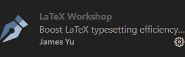

# LaTeX配置

### 一、TeX系统介绍及安装

**1、TeX Live**

TeX Live是一个完整的TeX发行版，包含了TeX、LaTeX、pdfTeX、XeTeX、LuaTeX等众多TeX相关的工具，以及一些相关的工具如字体转换器、PostScript处理器等。TeX Live是跨平台的，支持Windows、Linux、Mac OS X等操作系统。由于TeX Live是一个完整的TeX发行版，所以安装包比较大，有4G多。

下载地址：[TeX Live](https://www.tug.org/texlive/)

**2、MiKTeX**

MiKTeX相对于TeX Live来说，它是一个轻量级的TeX发行版，只包含了基本的TeX工具，如果硬盘空间小，MiKTeX是一个不错的选择。

下载地址：[MiKTeX](https://miktex.org/download)

---

### 二、LaTeX插件

**1、LaTeX Workshop**

基础且强大的LaTeX辅助插件！！！



---

 
### 三、LaTeX插件在VScode中的设置

**LaTeX 配置代码如下（不包含外部 pdf 查看器设置）**
```
{
    "latex-workshop.latex.autoBuild.run": "never",
    "latex-workshop.showContextMenu": true,
    "latex-workshop.intellisense.package.enabled": true,
    "latex-workshop.message.error.show": false,
    "latex-workshop.message.warning.show": false,
    "latex-workshop.latex.tools": [
        {
            "name": "xelatex",
            "command": "xelatex",
            "args": [
                "-synctex=1",
                "-interaction=nonstopmode",
                "-file-line-error",
                "%DOC%"
            ]
        },
        {
            "name": "pdflatex",
            "command": "pdflatex",
            "args": [
                "-synctex=1",
                "-interaction=nonstopmode",
                "-file-line-error",
                "%DOC%"
            ]
        },
        {
            "name": "latexmk",
            "command": "latexmk",
            "args": [
                "-synctex=1",
                "-interaction=nonstopmode",
                "-file-line-error",
                "-pdf",
                "-outdir=%OUTDIR%",
                "%DOC%"
            ]
        },
        {
            "name": "bibtex",
            "command": "bibtex",
            "args": [
                "%DOC%"
            ]
        }
    ],
    "latex-workshop.latex.recipes": [
        {
            "name": "XeLaTeX",
            "tools": [
                "xelatex"
            ]
        },
        {
            "name": "PDFLaTeX",
            "tools": [
                "pdflatex"
            ]
        },
        {
            "name": "BibTeX",
            "tools": [
                "bibtex"
            ]
        },
        {
            "name": "LaTeXmk",
            "tools": [
                "latexmk"
            ]
        },
        {
            "name": "xelatex -> bibtex -> xelatex*2",
            "tools": [
                "xelatex",
                "bibtex",
                "xelatex",
                "xelatex"
            ]
        },
        {
            "name": "pdflatex -> bibtex -> pdflatex*2",
            "tools": [
                "pdflatex",
                "bibtex",
                "pdflatex",
                "pdflatex"
            ]
        },
    ],
    "latex-workshop.latex.clean.fileTypes": [
        "*.aux",
        "*.bbl",
        "*.blg",
        "*.idx",
        "*.ind",
        "*.lof",
        "*.lot",
        "*.out",
        "*.toc",
        "*.acn",
        "*.acr",
        "*.alg",
        "*.glg",
        "*.glo",
        "*.gls",
        "*.ist",
        "*.fls",
        "*.log",
        "*.fdb_latexmk"
    ],
    "latex-workshop.latex.autoClean.run": "onFailed",
    "latex-workshop.latex.recipe.default": "lastUsed",
    "latex-workshop.view.pdf.internal.synctex.keybinding": "double-click"
}
```

**LaTeX配置代码解读**

```
"latex-workshop.latex.autoBuild.run": "never"
```
设置何时使用默认的(第一个)编译链自动构建 LaTeX 项目，即什么时候自动进行代码的编译。有三个选项：
1. ```onFileChange```：在检测任何依赖项中的文件更改(甚至被其他应用程序修改)时构建项目，即当检测到代码被更改时就自动编译tex文件；
2. ```onSave```: 当代码被保存时自动编译文件；
3. ```never```: 从不自动编译，即需编写者手动编译文档

---

```
"latex-workshop.showContextMenu": true
```
是否启用右键LaTeX快捷菜单

---

```
"latex-workshop.intellisense.package.enabled": true
```
设置为```true```，则该拓展能够从使用的宏包中自动提取命令和环境，从而补全正在编写的代码。

---

```
"latex-workshop.message.error.show"  : false,
"latex-workshop.message.warning.show": false
```
这两个命令是设置当文档编译错误时是否弹出显示出错和警告的弹窗。因为这些错误和警告信息能够从终端中获取，故设置均设置为```false```。

---

```
"latex-workshop.latex.tools": [
        {
            "name": "xelatex",
            "command": "xelatex",
            "args": [
                "-synctex=1",
                "-interaction=nonstopmode",
                "-file-line-error",
                "%DOC%"
            ]
        },
        {
            "name": "pdflatex",
            "command": "pdflatex",
            "args": [
                "-synctex=1",
                "-interaction=nonstopmode",
                "-file-line-error",
                "%DOC%"
            ]
        },
        {
            "name": "latexmk",
            "command": "latexmk",
            "args": [
                "-synctex=1",
                "-interaction=nonstopmode",
                "-file-line-error",
                "-pdf",
                "-outdir=%OUTDIR%",
                "%DOC%"
            ]
        },
        {
            "name": "bibtex",
            "command": "bibtex",
            "args": [
                "%DOC%"
            ]
        }
    ]
```
这些代码是定义在下文```recipes```编译链中被使用的编译命令，此处为默认配置，不需要进行更改。其中的```name```为这些命令的标签，用作下文```recipes```的引用；而```command```为在该拓展中的编译方式。
```"%DOC%"```可以修改为```%DOCFILE%```。```%DOCFILE%```表明编译器访问没有扩展名的根文件名，而```"%DOC%"```表明编译器访问的是没有扩展名的根文件完整路径。这就意味着，使用```%DOCFILE%```可以将文件所在路径设置为中文，但不建议这样，因为涉及到代码，当其余编译器引用时该```tex```文件时仍需要根文件完整路径，且需要为英文路径。

---

```
"latex-workshop.latex.recipes": [
        {
            "name": "XeLaTeX",
            "tools": [
                "xelatex"
            ]
        },
        {
            "name": "PDFLaTeX",
            "tools": [
                "pdflatex"
            ]
        },
        {
            "name": "BibTeX",
            "tools": [
                "bibtex"
            ]
        },
        {
            "name": "LaTeXmk",
            "tools": [
                "latexmk"
            ]
        },
        {
            "name": "xelatex -> bibtex -> xelatex*2",
            "tools": [
                "xelatex",
                "bibtex",
                "xelatex",
                "xelatex"
            ]
        },
        {
            "name": "pdflatex -> bibtex -> pdflatex*2",
            "tools": [
                "pdflatex",
                "bibtex",
                "pdflatex",
                "pdflatex"
            ]
        }
    ]
```
此串代码是对编译链进行定义，其中```name```是标签，也就是出现在工具栏中的链名称；```tool```是```name```标签所对应的编译顺序，其内部编译命令来自上文```latex-workshop.latex.recipes```中内容。

定义完成后，能够在 vscode 编译器中能够看到的编译顺序
