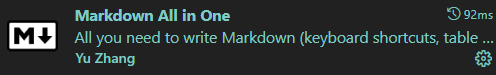
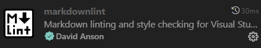

# 在VSCode中使用Markdown

### 一、插件安装及配置

**1、Markdown All in One**

辅助Markdown书写，强大的.md辅助插件

---

**2、Markdown Preview Github Styling**

将预览窗口风格渲染为Github风格

---

**3、MarkdownLint**

针对 Markdown 的语法风格检查

---
 
### 二、VSCode 设置

**1、Markdown 文档显示设置**
```
"[markdown]": {
                "files.trimTrailingWhitespace":false,
                "editor.fontFamily": "Consolas",
                "editor.fontSize": 16,
                "editor.lineNumbers": "relative",
            } 
```
**以上条目的具体作用:**

files.trimTrailingWhitespace：是否删除行尾空格

editor.fontFamily: 字体

editor.fontSize: 字体大小

editor.lineNumbers: 显示行号

---

**2、Markdown 文档预览效果设置**
```
"markdown.preview.fontFamily": "Consolas",
"markdown.preview.linkify": false
``` 
**以上条目的具体作用:**

markdown.preview.fontFamily：预览窗口字体

markdown.preview.linkify: 预览中对于链接的自动识别


### 三、VSCode 基本语法

一级标题: #

二级标题: ## 

三级标题: ### 

每写完一个段落要隔一行空行.

就像这样, 隔了一行空行.

分割线: ---

**重点加粗**

*斜体*

~~删除线~~

---

列表:

* 无序列表
  * 嵌套无序列表
  * 嵌套无序列表
* 无序列表
* 无序列表

1. 有序列表 1
   1. 嵌套有序列表 1
   2. 嵌套有序列表 2
2. 有序列表 2
3. 有序列表 3

---

引用文本:

> 引用别人说的话
> 就这样写
> By. OrangeX4

---

这是 `行内代码` 语法.

代码块语法:

``` python
print("Hello, World!")
```

请将 ' 替换成 `.

---

[超链接名称](链接地址)


---

表格:

| 表头 | 表头 |
| ---- | ---- |
| 内容 | 内容 |
| 内容 | 内容 |

---

注释:

<!-- 你看不见我 -->